# Low-Power 4-Bit Ripple Carry Adder

Transistor-level design and optimization of a 4-bit ripple carry adder in Cadence Virtuoso, exploring the trade-off between delay and energy through threshold-voltage selection, transistor sizing, input reordering, and dual-supply operation.

**Tools:** Cadence Virtuoso · SVT / LVT / HVT transistor libraries · Multi-VDD simulation
**Author:** Shaik Tahir Mohammed Hussain — M.Eng. ECE, University of Ottawa

---

## Overview

A ripple carry adder is built by chaining full adders, where each stage waits on the carry from the previous one. This makes the **carry chain the critical path** of the circuit — it directly sets the maximum delay, while the sum outputs at each stage have varying degrees of timing slack.

This project starts from a baseline single-threshold design, measures its delay/energy characteristics across three threshold-voltage libraries (SVT, LVT, HVT), identifies the critical path, and then applies five targeted optimization techniques to reduce energy consumption **without sacrificing the delay of the critical path**.

**Result: 80.06% reduction in static energy and 61.13% reduction in total energy, with delay held comparable to the fastest (LVT) baseline.**

---

## Project Summary

| Item | Details |
|---|---|
| Project | Low-Power 4-bit Ripple Carry Adder |
| Tool Used | Cadence Virtuoso |
| Technology | CMOS Transistor-Level Design |
| Techniques | Multi-VT, Multi-VDD, Transistor Sizing, Input Stacking |
| Objective | Reduce Delay and Energy Consumption |
| Best Result | 61.13% Reduction in Total Energy |

---

## Skills Demonstrated

- CMOS Digital Circuit Design
- Cadence Virtuoso
- Delay Analysis
- Static & Dynamic Power Analysis
- Multi-VT Optimization
- Multi-VDD Optimization
- Transistor Sizing
- Critical Path Analysis
- Energy-Delay Product (EDP) Evaluation

---

## Project Workflow

```
Design Specification
        ↓
Full Adder Design
        ↓
4-bit Ripple Carry Adder
        ↓
Power & Delay Analysis
        ↓
Optimization Techniques
        ↓
Performance Comparison
```

---

## 1. Circuit Design

The adder is built from full-adder stages using 2-input and 3-input NAND gates, chained together to form the 4-bit ripple structure.

| | |
|---|---|
| 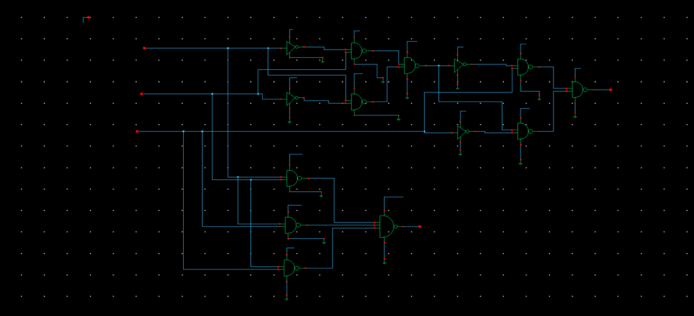 | 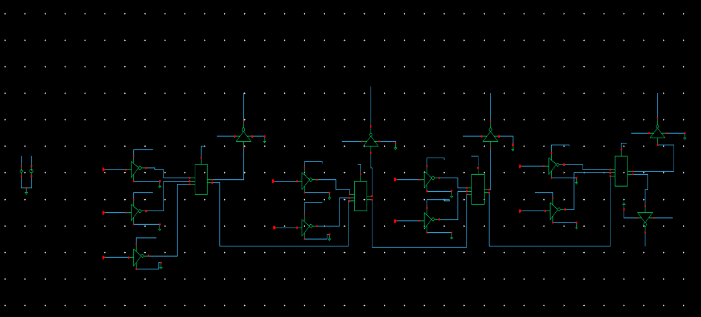 |
| Single full adder (NAND-based) | Full 4-bit ripple carry adder |

**Critical path:** measuring delay from each input to each output showed the path from **R0 → S3** has the highest delay (through the full carry chain), making it the critical path that must be preserved through every optimization.

---

## 2. Baseline Threshold-Voltage Comparison

The same design was implemented and simulated across three transistor libraries to characterize the delay/energy trade-off space before any optimization.

| SVT | LVT |
|---|---|
| 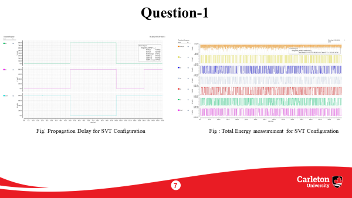 | 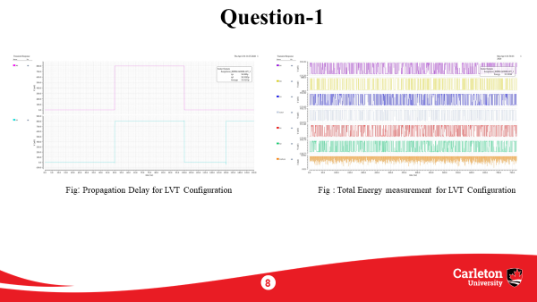 |

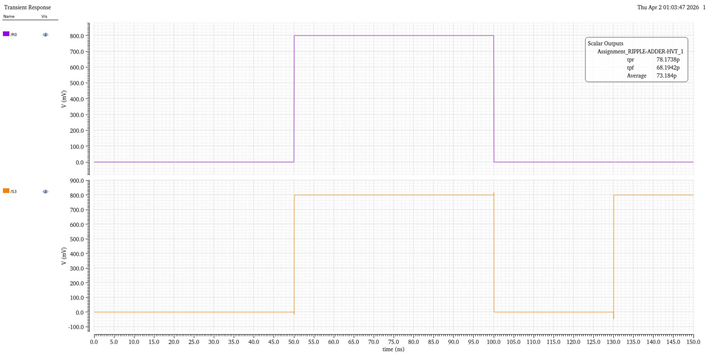
*HVT transient response — average delay 73.184 pS*

| | Rising Delay (pS) | Falling Delay (pS) | Average Delay (pS) | Static Energy (aJ) | Dynamic Energy (fJ) | Total Energy (fJ) | ED-Product (×10⁻²⁴) |
|---|---|---|---|---|---|---|---|
| **LVT** | 56.888 | 50.959 | 53.923 | 780.35 | 32.64 | 33.35 | 1.798 |
| **SVT** | 71.983 | 62.531 | 67.257 | 218.25 | 31.97 | 32.183 | 2.164 |
| **HVT** | 78.174 | 68.194 | 73.184 | 125.75 | 32.02 | 32.147 | 2.352 |

**Takeaway:** LVT is fastest but leaks the most; HVT is slowest but leaks the least. Delay increases with V<sub>T</sub> because higher threshold voltage reduces drive current, while energy drops because leakage current falls — and since delay dominates the ED-product, it rises with V<sub>T</sub> despite the energy savings. Neither extreme alone is optimal — this motivated a **mixed approach** rather than picking one library for the whole circuit.

---

## 3. Supply Voltage (V<sub>DD</sub>) Sweep

To understand the energy/delay trade-off along the voltage axis as well, V<sub>DD</sub> was swept from 0.1 V to 1.0 V.

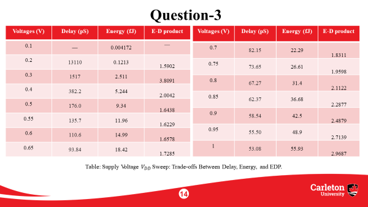

Delay drops sharply as V<sub>DD</sub> increases from near-threshold operation, while energy rises steadily — confirming that the lowest-energy operating point isn't necessarily the best point once delay is factored in via the ED-product. This informed the voltage selection used in the Multi-VDD technique below.

---

## 4. Optimization Techniques

Five techniques were applied together, each targeting a different part of the design based on whether it sits on the critical (carry) path or has timing slack (sum path).

### 4.1 Multi-Threshold Voltage (Multi-VT)

The **carry path** (critical) was kept on **LVT** transistors for maximum drive strength and speed. The **sum path** (non-critical, has timing slack) was moved to **SVT/HVT** transistors to cut leakage current where speed isn't the bottleneck.

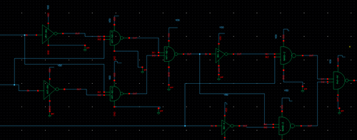

### 4.2 Transistor Sizing

Fin counts were tuned per gate type to compensate for stacking effects: 2-input NAND gates use 4 PMOS / 8 NMOS fins, while 3-input NAND gates are upsized to 8 PMOS / 16 NMOS fins to maintain drive strength against the added series resistance of the extra stacked transistor.

| 2-input NAND (LVT) | 3-input NAND (LVT) |
|---|---|
| 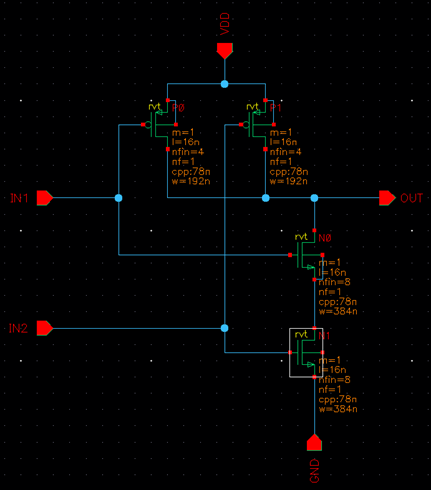 | 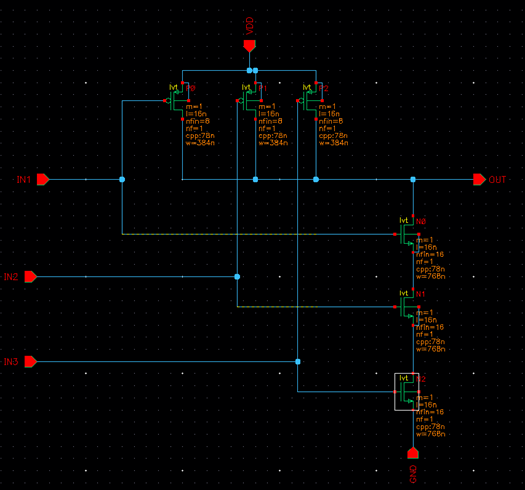 |

### 4.3 Input Stacking Optimization

Within each NAND gate, inputs were ordered by arrival time — the **latest-arriving signal is placed closest to the output node**, so the gate doesn't have to wait on an internal node to settle after that input switches. In the carry chain, input C arrives later than A and B, so C sits closest to the output.

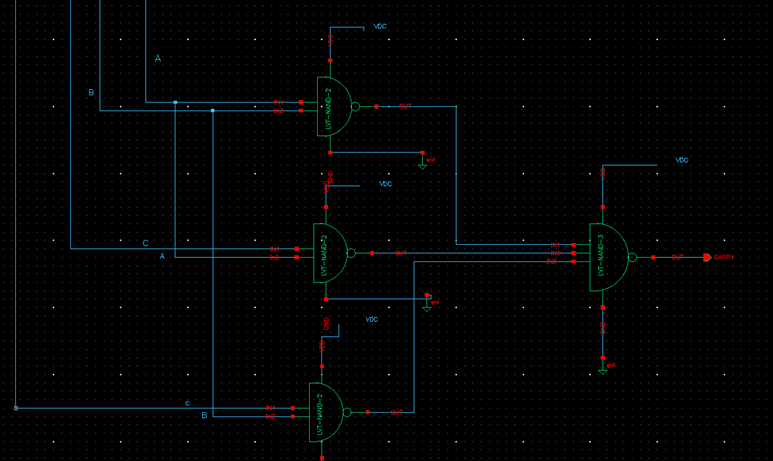

### 4.4 Multi-VDD

Two supply rails were used: **0.74 V** for critical-path elements (e.g. input inverters, which need higher drive strength for fast transitions) and **0.68 V** for non-critical paths to cut dynamic power without affecting overall timing.

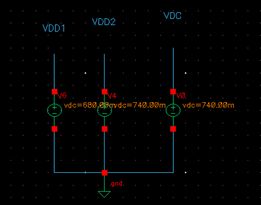

### 4.5 Mixed VT Within the Same Circuit

Combining the above, HVT devices were used at points off the critical path where leakage matters more than speed — shown here in a 2-input NAND built on HVT transistors, used in the non-critical sum path.

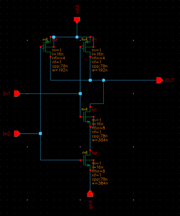

---

## 5. Final Results

After applying all five techniques together:

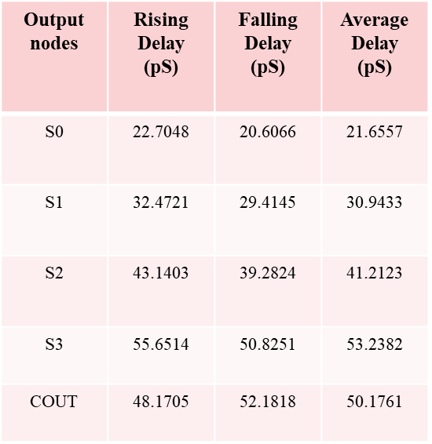

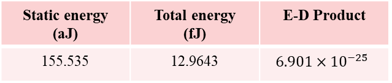

| Metric | Before (LVT baseline) | After Optimization | Improvement |
|---|---|---|---|
| Static Energy | 780.35 aJ | 155.535 aJ | **80.06% reduction** |
| Total Energy | 33.35 fJ | 12.9643 fJ | **61.13% reduction** |
| Delay | 53.923 pS (avg) | Comparable to baseline | Maintained |

The critical path (carry chain) retains its original delay by staying on fast LVT transistors with input stacking, while every other part of the circuit trades unneeded speed for lower leakage and dynamic power — achieving the energy savings essentially "for free."

---

## Summary

| Technique | Applied To | Benefit |
|---|---|---|
| Multi-VT | Carry path (LVT) vs. Sum path (SVT/HVT) | Speed where needed, low leakage elsewhere |
| Transistor Sizing | 2-in vs 3-in NAND gates | Compensates for stacking effect |
| Input Stacking | NAND gate input order | Reduces effective delay per gate |
| Multi-VDD | Critical (0.74V) vs non-critical (0.68V) | Cuts dynamic power off critical path |
| Mixed VT | Circuit-wide | Fine-grained speed/leakage trade-off |

---

## Conclusion

This project demonstrates how transistor-level optimization techniques can significantly reduce energy consumption while maintaining acceptable delay performance. The work highlights practical CMOS design, simulation, timing analysis, and power optimization using Cadence Virtuoso.

---

## Future Work

- Implement an 8-bit and 16-bit Ripple Carry Adder
- Compare with Carry Lookahead Adder (CLA)
- Evaluate using newer CMOS technology nodes
- Explore additional low-power optimization techniques

---

## License

This project is shared under the MIT License — see [LICENSE](LICENSE) for details.
